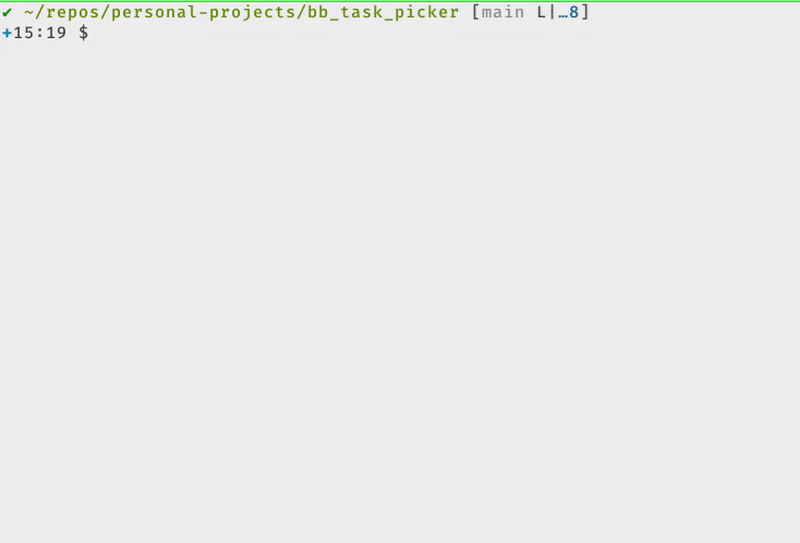

Title: bb-fzf: A Babashka Tasks Picker
Tags: clojure, babashka, fzf, interactive, tooling, cli
Date: 2025-04-03
Description: Run Babashka tasks faster with bb-fzf. This guide shows how to use fzf's fuzzy finding to select and execute Clojure tasks defined in bb.edn via your CLI.

This post introduces a Babashka Tasks helper I put together make it easier to
use `bb tasks` interactively. Here's the [bb-fzf repo][] link.

The main things the helper adds are:

- the use of fzf for fuzzy task selection to help you type less
- the ability to invoke bb tasks from any sub-directory in your repo
- a bit of pretty-printing with the help of [Bling][]

Babashka and fzf are two tools that are consistently part of my workflow,
regardless of what I'm doing. I've briefly wrote about them in my previous
post, [PhuzQL: A GraphQL Fuzzy Finder][], where I combined them together with
Pathom to create a simple GraphQL explorer. In short, Babashka lets you write
Clojure scripts with a fast startup time and fzf is an interactive picker with
fuzzy text matching to save you some keystrokes.

Babashka includes a tasks feature that is somewhat like a Makefile replacement,
allowing you to define named tasks in a `bb.edn` file and then execute them
with `bb <task name> [optional params]`. bb-fzf just lets you pick from your
list of tasks interactively - think of it as an ergonomic autocomplete.

A quick demo showing:

- simple task selection
- argument support
- output formatting (callouts, color, task selection, repo root)

Check out the README in the [bb-fzf repo][] for more details on installation
and usage. There's always room for improvement, but this is sufficient for my
needs for now. In the future I might add a preview window and more robust argument
handling with the help of [babashka.cli][].

Issues and PRs in the repo are welcome.

[bb-fzf repo]: https://github.com/sheluchin/bb-fzf
[PhuzQL: A GraphQL Fuzzy Finder]: /phuzql_poc.html
[Bling]: https://github.com/paintparty/bling/
[Babashka]: https://book.babashka.org/
[babashka.cli]: https://github.com/babashka/cli
