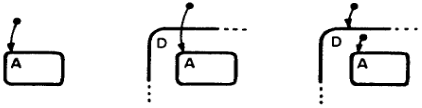
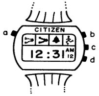

Title: SCXML-Inspired State Charts In Clojure(script)
Date: 2025-01-18
Tags: scxml, fulcro, clojure, cljc, statecharts, state-machines, harel, asked-clojure
Description: Playing games with Fulcro Statecharts (based on SCXML)

> **Note:** This post is the second in my [asked-clojure](tags/asked-clojure) series.




In this article I attempt to distill some of the core concepts in the
[Statecharts library][] that has been gaining interest lately. I will do so by
covering a little bit of history, explaining key ideas and illustrating them
through short examples:

- a coin flip
- rock paper scissors
- ~~poker~~ (left for a future post)

Getting started with the coin flip example, I ran into a few things I wasn't
certain of. I wanted a minimal implementation that I could add to in order to
make it a gradual learning progression. I had a coin with two states: heads and
tails, and I wanted to add a flip transition between them that would randomly
transition to one of the two states. My implementation seemed too complex for
such a simple idea, so I turned to asking for input in a [Slack
thread][Original discussion link]. I received some great advice about
simplifying the transition, a pragmatic naming convention for element ids and
some rationale for why my original approach isn't the right way to go about it.

A final note: while the library is by Fulcrologic and includes Fulcro
integration helpers, you can also use it without Fulcro. It's a fairly small
library with very few dependencies. That's what I'll be doing here, and in
subsequent posts, I plan to extend the examples below by adding Fulcro data
management and UI rendering.

## A Short History
> Note: while this section does offer some valuable context about how
> statecharts fit within the broader scope of state machines, feel free to skip
> ahead to the [examples](#examples) if you just want to see some code.

The history of state machines dates back to the early-mid 19th century,
pioneered by notables such as Claude Shannon, Edward F. Moore and John von
Neumann, among others. A reasonable place for us to start is with the concept of
[finite-state machines][] (FSM), which are the basis for Statecharts.

A state machine is an abstract description of a system with a finite number of
possible states, only one of which represents the system at any given time.
This is the high-level definition as established through the research on FSMs.




In 1987, David Harel published _[Statecharts: A Visual Formalism for Complex
Systems][Statecharts: A Visual Formalism by David Harel 1987]_, a paper which
extended the work on FSMs in several key areas:

- hierarchical (nested) states
- concurrent states
- state history

Furthermore, as the title indicates, Harel presented a new method for
visualizing stateful systems. The paper is a fun read, using the Citizen Quartz
Multi-Alarm III watch (pictured above) as the basis for demonstrating how to
use Statecharts to describe complex systems. I recommend reading it!

In 2002, a working draft was published by the World Wide Web Consortium (W3C)
on a new standard called [Call Control eXtensible Markup Language
(CCXML)][CCXML]. This is an XML-based language designed for call control in
telephony applications. It incorporated many of the concepts from Harel's paper
and combined them with XML encoding.

Later on, in 2005, the first draft of [State Chart extensible Markup Language
(SCXML)][SCXML] was published by the W3C. This is a standard inspired by both CCXML and
Harel's Statecharts with the goal of providing a "generic state-machine based
execution environment". Since its proposal, it has graduated to become a W3C
Recommendation, indicating it has passed several rounds of review and should be
considered "production ready". An interesting turn of events is that the _next_
version of CCXML will likely be based on SCXML.

Lastly, the Statecharts library is based on SCXML structure and semantics, but
deviates from the standard slightly when it comes to "executable content". In
short - and covered in more detail below - Statecharts leans into making the
ideas and constructs of SCXML more idiomatic in Clojure(script), while still
making an effort to maintain compatibility with the standard. This approach
allows Statecharts to make the most of the work that has gone into the standard
and associated tooling.

## Core Concepts
### State
From [Wikipedia][finite-state machines]:
> A state is a description of the status of a system that is waiting to
> execute a transition.

#### Compound State
A state containing one or more sub-states.

#### Atomic State
A state without sub-states.

### Transition
A change from one state to a target state. These are _often_ the result of
events, but the SCXML standard does allow eventless transitions as well.

### Configuration
The set of states (including sub-states) that are currently active.

### Executable Content
Hooks that allow the state machine to modify its data model and interact with
external entities.

In the Statecharts library, these are represented by a function of two
arguments: `[env data]`. You'll see these in `:cond` values and other
places like `script` elements.

# Examples
The examples below are available in full in my [fnguy-examples][] repo. You will
need to refer there to see all the scaffolding functions I use to run these
statecharts and interact with them. That code is largely based on the examples
in the [Statecharts docs][] and is not optimized for production use.

## Coin Flip
This was my starting point. I decided to start with this simple idea of
creating a statechart that represents a coin flip and build up from there. The
basis is a coin that can be flipped any number of times and would land on
either heads or tails:

- states: heads, tails
- transitions: flip

First let's define the chart:

```clojure
(def coin-flips
  (let [heads :id/heads
        tails :id/tails
        pick-rand #(rand-nth [heads tails])]
    (statechart {}
      (state {:id heads}
        (transition {:event :flip
                     :target tails
                     ;; BUG! `pick-rand` will be called in each visited transition
                     :cond (fn [_ _] (= tails (pick-rand)))})
        (transition {:event :flip
                     :target heads
                     :cond (fn [_ _] (= heads (pick-rand)))}))
      (state {:id tails}
        (transition {:event :flip
                     :target heads 
                     :cond (fn [_ _] (= heads (pick-rand)))})
        (transition {:event :flip
                     :target tails
                     :cond (fn [_ _] (= tails (pick-rand)))})))))
```

With the chart defined, we now move on to interacting with it by first starting
it and then sending a single `:flip` event:

```clojure
(fnsc/start-new-sc! 1 ::coin-flips coin-flips)
; Event loop started
; Processing event on statechart => :com.fnguy.coin-flip/coin-flips
; target(s) => [:id/heads]
; Enter :id/heads
; after enter states:  => #{:id/heads}  ➊
; conflicting? => #{}
(fnsc/send-event! 1 :flip)
; Processing event on statechart => :com.fnguy.coin-flip/coin-flips
; external-event =>
; {:type :com.fulcrologic.statecharts/chart,  ❷
;  :name :flip,
;  :target 1,
;  :data {},
;  :com.fulcrologic.statecharts/event-name :flip}
; Running expression #function[com.fnguy.coin-flip/fn--36551/fn--36554]  ❸
; (sp/run-expression! execution-model env expr) => false
; (boolean (run-expression! env cond)) => false
; evaluating condition #function[com.fnguy.coin-flip/fn--36551/fn--36556]
; Running expression #function[com.fnguy.coin-flip/fn--36551/fn--36556]
; (sp/run-expression! execution-model env expr) => false  ❹
; (boolean (run-expression! env cond)) => false
; conflicting? => #{}
; enabled transitions => #{}
; entry set => [#{} #{} {}]
; after enter states:  => #{:id/heads}
; conflicting? => #{}  ❺
```

The above shows a basic REPL interaction where I start the statechart and then
send it a single `:flip` event. After each interaction, I've also included
some of the log statements that were emitted using the default logging config
with a bit of manual edits to suit the blog format. A few things to notice:

- ➊ starting the chart puts it in an initial state, even before any events are sent:
  - this is the [configuration](#configuration)
- ❷ event details are logged, showing this as an external event with no event data
- ❸ the statechart runs _some_ expression and shows us the result, but the current names aren't helpful
- ❹ the boolean value of the expression
- ❺ there are no conflicts, it's an empty set:
  - a conflict arises when multiple enabled transitions have intersecting exit sets:
    - i.e. multiple enabled transitions exit one or more of the same states

I won't be repeating the entire log output for each interaction, but it's
helpful to be aware of what's in there (subject to change) as it's useful for
troubleshooting.

While this chart seems like it works, someone in the Slack thread helpfully
pointed out a small logical bug: `pick-rand` can potentially be executed
multiple times. If the first transition's `:cond` evaluates to a falsey value,
the next sibling transition will call `pick-rand` _again_ and might also eval
to false, causing neither transition to execute. That's not what we want!

You might be thinking that moving the `pick-rand` evaluation somewhere to a
higher scope and allowing both sibling transitions to look at that value is the
fix, but that's not exactly right. Each transition element should be viewed as
an independent node in the graph. Also, the chart, once initiated, is just a
nested data structure. Adding in dynamic computations is possible, but there
are specific ways to do that. You can't just add in a `let` form wherever,
since it would only be evaluated once. We could technically solve this by
putting the flip result data in the data model, but I wanted to keep this
example minimal and adding a data model struck me as too elaborate.

The alternative implementation suggested to me is even simpler than my original:

```clojure
(def simpler-coin-flip
  (statechart {}
    (state {:id :state/coin}
      (transition {:id :transition/coin->heads
                   :target :state/heads
                   :event :event/flip
                   :cond (fn [& _] (rand-nth [true false]))})
      (transition {:id :transition/coin->tails
                   :target :state/tails
                   :event :event/flip})
      (state {:id :state/heads})
      (state {:id :state/tails})))))
```

Improvements over the original:

- from four total transitions to just two
- the transitions are at the top-level of the `:state/coin` state rather than nested
- there is just a single `:cond` on the first transition instead of on each one
- no need for a data model

The key thing to understand here is that when you have multiple transitions
within a state, they are visited in document order. If a transition is enabled,
subsequent siblings will not be. In other words, if `:transition/coin->heads`'s
`:cond` returns true, the transition moves to its `:target` state and
`:transition/coin->tails` will be ignored. If, on the other hand, the predicate
returned false, the next transition (to tails) would happen unconditionally.
Now we have just a single evaluation of the predicate, so the bug noted above
is fixed while also simplifying the code.

I've also made some slight adjustments to the code by giving namespaced `:id`
values to all of the elements. This was suggested to me by Slack user
[`@Michael W`][Michael W Profile] (see their Statecharts-based [chatbot
repos][Michael W Repos]) and greatly helps to make the logging easier to
understand. One additional logging-related improvement you could make is to
convert the anonymous `:cond` fn to a named function using `defn`. You can
see the difference in these two before/after log statements:

```
evaluating condition #function[com.fnguy.coin-flip/fn--40594]
evaluating condition #function[com.fnguy.coin-flip/random-flip]
```

For such a simple chart, this 👆 small optimization may not be worth it, but as
complexity grows, it can be very helpful for observability.

Lastly, in my examples repo I also included another version of the coin flip
statechart which remembers the total number of `:heads` and `:tails`
results. It's a small change so I won't include it here. Try it yourself and
refer to the repo if you need a hint.

## Rock Paper Scissors
This example covers a game of rock paper scissors, which offers slightly more
complicated mechanics than a coin flip does:

- there are two players rather than one
- there are three possible outcomes per player action ("throwing" or revealing your hand):
- player outcomes must be compared, with three possible results:
  - player 1 wins
  - player 2 wins
  - draw
- the winning player is declared at the end of the best 2-of-3 game

Here is the complete statechart:

```clojure
(def rps
  (statechart {}
    (data-model {:expr {:state/player1 {:player/score 0}
                        :state/player2 {:player/score 0}}})
    (state {:id :state/game
            :initial :state/r1}
      (state {:id :state/r1}
        (transition {:id :transition/r1->r2
                     :event :event/throw
                     :target :state/r2
                     :cond not-draw?})
        (on-exit {} (update-winner-score)))
      (state {:id :state/r2}
        (transition {:id :transition/r2->tie-breaker
                     :event :event/throw
                     :target :state/tie-breaker
                     :cond ->tie-breaker?})
        (transition {:id :transition/r2->game-over
                     :event :event/throw
                     :target :state/game-over
                     :cond ->game-over?})
        (on-exit {} (update-winner-score)))
      (state {:id :state/tie-breaker}
        (transition {:id :transition/tie-breaker->game-over
                     :event :event/throw
                     :target :state/game-over
                     :cond not-draw?})
        (on-exit {} (update-winner-score)))
      (state {:id :state/game-over}
        (on-entry {}
          (log {:level :info
                :expr log-game-winner}))))))
```

Things to notice:
1. there are no states to represent the players
2. a `data-model` element keeps track of player scores
3. namespaced keywords (`:transition`, `:event`, `:state`) for improved logging
4. `on-entry`, `on-exit` and `log` elements
5. functions are defined separately

When I started writing this chart, having player states seemed like an obvious
requirement. My thinking was that each player would have at least their score
and would wait for some event to play each round, producing an outcome for each
`:event/throw`. This would require keeping two parallel compound states:
rounds and players, thereby allowing rounds and players to be simultaneously
active and reacting to events by transitioning their internal states or at
least updating their state-local data models. When I tried this approach, I ran
into problems with transition conflicts and had to change some of the
transitions to `:type :internal` to get _closer_ to a working model.
Something felt off - the solution I was headed toward was once again becoming
too complicated.

It took some time to arrive at the above definition. Of course, there are many
ways one could model this simple game. I will explain the choices I made.

### Data Model Implementatation
In my trials, I used Fulcro's `FlatWorkingMemoryDataModel`. This particular
implementation "puts all data into a single scope (a map which itself can be a
nested data structure)", meaning there is just one big map that keeps track of
the data model of the statechart and all of its sub-states. The docs also
mention an alternative implementation, the `WorkingMemoryDataModel`, which
"scopes data to the state in which it is declared". The source code suggests to
use it with caution:

> WARNING: This model is not recommended for many use-cases. The contextual
> paths turn out to be rather difficult to reason about. The flat data model is
> recommended. [(Source.)][WorkingMemoryDataModel note]

I stuck with the recommended flat model that puts all the data into a single
top-level map. With that decided, the first part of my reasoning for having
player states - that each player would "hold" their score - was no longer
valid.

### Events and Transitions
The second part of my reasoning was that each player state would be responsible
for determining its own throw outcome. Intuitively, this made sense to me (see
[state](#state)). A player would be modeled as a system waiting to execute a
transition: from an idle state where their hand is not in play, to a thrown
state resulting in one of the three RPS hand gestures. The round winner would
then be determined, player scores incremented accordingly and the game would
transition to the next round.

The trouble here is that using parallel states brings on additional complexity
regarding transition conflicts and the value of an idle player state
transitioning to a thrown state and then back again is not clear.

My solution resolved on getting rid of the players state and the parallelism
with the rounds state such a design would necessitate. Instead, the
`:round/winner` is decided as an integral part of the throwing event
(`:event/throw`):

```clojure
(defn random-throw [] (rand-nth [:rock :paper :scissors]))

(defn throw->winner []
  (let [p1-throw (random-throw)
        p2-throw (random-throw)
        winner (pick-winner p1-throw p2-throw)]
    winner))

(comment
  (fnsc/send-event! ::rps :event/throw
                    ;; Send as part of the event's data
                    {:round/winner (throw->winner)}))
```

Now let's see how this applies to the initial game state, `:state/r1`:

```clojure
(defn not-draw? [_env data] (not (data->round-draw? data)))

(defn update-winner-score []
  (script-fn [_env data]
    (let [winner-id (data->round-winner data)
          new-score (data->new-winner-score data)]
      [(ops/assign [winner-id :player/score] new-score)])))

;; One part of the chart, not a top-level definition
(state {:id :state/r1}
  (transition {:id :transition/r1->r2
               :event :event/throw
               :target :state/r2
               :cond not-draw?})
  (on-exit {} (update-winner-score)))
```

- the state is entered when the chart starts, since it's marked as `:initial` in the parent
- a `:cond` ensures there is no transition in case of a draw - it stays on round 1
- if `:transition/r1->r2` is enabled, it moves to round 2
- moving to `:state/r2` updates round winner scores on exit

This highlights some important design decisions when creating statecharts:

- State decomposition: which aspects of the system should be represented
  as distinct states within the statechart?
- Interaction flow: what elements of interaction are generated internally by the states, as
  opposed to those that are conveyed through the events to which the states 
  respond?

As mentioned, of course there are other ways a game of rock paper scissors
could be designed as a statechart. The above explains the process I went
through and the lessons learned along the way. Design is rarely an aspect with
clear answers, just a set of trade-offs that need to be considered to arrive at
a good fit for the problem at hand.

# Wrapping Up
This article covered statecharts history as well as a few of the core concepts,
demonstrated through simple examples. I must stress that the concepts covered
are by no means comprehensive. I excluded important aspects of the SCXML
standard, such as history, invocations, event queue processing and many others.
The Statecharts library has direct analogs for many of these, and likewise has
a few of its own concerns that I've not written about here such as different data
model implementations, invocation processors, testing and Fulcro integration.
My objective here was to explain raw statecharts in the simplest form rather
than provide a comprehensive explanation of the all the facets. Refer to the
source material to learn more.

The examples above cover states, transitions, guards, events and how to
leverage a statechart's data model. Everything was done strictly in the REPL
with plain statecharts with no additional required dependencies.

I initially planned to cover a third example by modeling a game of poker as a
statechart. This post is already quite lengthy, so I decided to put the poker
example off to a future article in which I'll focus more on the Fulcro
integration helpers to build a simple webapp to serve as the UI for the game's
statechart.

# Links
- [Fulcro Statecharts Library](https://github.com/fulcrologic/statecharts)
- [Fulcro Statecharts Documentation](https://fulcrologic.github.io/statecharts/)
- [Fulcro with Statecharts GitHub Repository](https://github.com/fulcrologic/fulcro-with-statecharts/)
- [Fulcro with Statecharts Client Implementation](https://github.com/fulcrologic/fulcro-with-statecharts/blob/main/src/main/com/example/client.cljs)
- [Statecharts: A Visual Formalism by David Harel (1987)](https://www.state-machine.com/doc/Harel87.pdf)
- [SCXML Specification](https://www.w3.org/TR/2015/REC-scxml-20150901/)
- [CCXML Specification](https://www.w3.org/TR/2011/REC-ccxml-20110705/)
- [Clojurians Slack Original Discussion](https://clojurians.slack.com/archives/C68M60S4F/p1736528052852219)
- [Finite-State Machines on Wikipedia](https://en.wikipedia.org/wiki/Finite-state_machine)
- [fnguy-examples repo](https://github.com/sheluchin/fnguy-examples/tree/main/examples/fulcro_statecharts/)
- [Working Memory Data Model Note](https://github.com/fulcrologic/statecharts/blob/17da0f8ef793d8acd6c71f0502185916104a2d9d/src/main/com/fulcrologic/statecharts/data_model/working_memory_data_model.cljc#L109-L110)
- [Michael W's Slack Profile](https://clojurians.slack.com/team/UAB2NMK25)
- [Michael W's GitLab Repositories](https://gitlab.com/users/michaelwhitford/projects)


[Statecharts library]: https://github.com/fulcrologic/statecharts
[Statecharts docs]: https://fulcrologic.github.io/statecharts/
[Fulcro with Statecharts GitHub Repository]: https://github.com/fulcrologic/fulcro-with-statecharts/
[Client Implementation in Fulcro with Statecharts]: https://github.com/fulcrologic/fulcro-with-statecharts/blob/main/src/main/com/example/client.cljs
<!-- FIXME: make sure it doesn't show up in rendered html -->
[Statecharts: A Visual Formalism by David Harel 1987]: https://www.state-machine.com/doc/Harel87.pdf
[SCXML]: https://www.w3.org/TR/2015/REC-scxml-20150901/
[CCXML]: https://www.w3.org/TR/2011/REC-ccxml-20110705/
[Original discussion link]: https://clojurians.slack.com/archives/C68M60S4F/p1736528052852219
[finite-state machines]: https://en.wikipedia.org/wiki/Finite-state_machine
[fnguy-examples]: https://github.com/sheluchin/fnguy-examples/tree/main/examples/fulcro_statecharts/
[WorkingMemoryDataModel note]: https://github.com/fulcrologic/statecharts/blob/17da0f8ef793d8acd6c71f0502185916104a2d9d/src/main/com/fulcrologic/statecharts/data_model/working_memory_data_model.cljc#L109-L110
[Michael W Profile]: https://clojurians.slack.com/team/UAB2NMK25
[Michael W Repos]: https://gitlab.com/users/michaelwhitford/projects
