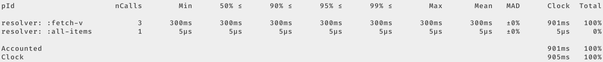
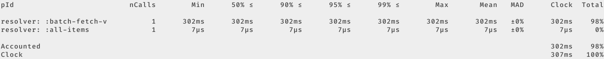

Title: Pathom3 Instrumentation
Date: 2025-02-14
Tags: clojure, pathom, instrumentation, performance, monitoring, tufte
Description: Instrumenting Pathom3 resolvers with Tufte

In this article I will explain how to get performance insights into your
[Pathom3][] resolvers by using [Tufte][]. My aim is to show a very basic
example of how it can be done, without doing a deep dive on any of the topics.

## Pathom

If you are unfamiliar with Pathom, its docs define it as "a Clojure/script
library to model attribute relationships". In essence, Pathom allows you to
create graph of related keywords and query it using the [EDN Query Language][]
(EQL). It supports read and write operations using resolvers and
mutations. The "magic" of it is that it produces an interface which abstracts
away function calling by handling all the graph traversal internally when
responding to EQL requests. What does that mean? A short example should suffice:

```clojure
;; create a few resolvers to model related attributes
(pco/defresolver all-items
  "Takes no input and outputs `:all-items` with their `:id`."
  []
  {::pco/output [{:all-items [:id]}]}
  {:all-items
   [{:id 1}
    {:id 2}
    {:id 3}]})

(pco/defresolver fetch-v
  "Takes an `:id` and outputs its `:v`."
  [{:keys [id]}]
  (Thread/sleep 300)
  {:v (* 10 id)})

;; query the graph for some data
(p.eql/process
 (pci/register [all-items fetch-v])
 ;; ask for the `:v` attribute of `:all-items`
 [{:all-items [:v]}])
; => {:all-items [{:v 10} {:v 20} {:v 30}]}
```
Source: Pathom3 docs on [Batch Resolvers][].

As you can see, once the graph is established, you only need to tell Pathom
_what_ you want, not how to get it. As long as there is enough data to satisfy
the input requirements of some initial resolver, its output can be used as
input to whatever other resolver(s) need to be used in order to satisfy the
entire request. Pathom will continue traversing the graph using whatever data
it has at each point in order to get all the requested attributes. An elaborate
chain of function calls is reduced to a single EQL expression.

While this does offer developers a great deal of power, one trade-off is that
it becomes a little bit harder to understand exactly what your program is doing
when you send your query to the Pathom parser. The above example creates a very
simple graph without much mystery, but real applications often include a large
number of resolvers, often with multiple paths for getting certain attributes.

## Tufte
Tufte is useful for understanding what happens when you send a query to your
Pathom parser. From the Tufte example in its repo's README, the basic usage is
like this:

```clojure
(tufte/profile ; Profile any `p` forms called during body execution
  {} ; Profiling options; we'll use the defaults for now
  (dotimes [_ 5]
    (tufte/p :get-x (get-x))
    (tufte/p :get-y (get-y))))
```

In plain English, we need to use `p` to wrap individual expressions and
`profile` to wrap a set of `p` expressions to profile them together.

# Profiling Pathom Queries
To put it together, we need to understand one last piece: [Pathom Plugins][].
Plugins allow developers to extend Pathom's functionality by wrapping specific
parts of its internal execution process with arbitrary extension code. The
various places you can add wrapping are identified by keywords. In our case, we
want to wrap individual resolver calls with `p` and the entire process (which
may call many resolvers) with `profile`. The keywords for these extension
points are:

- `::pcr/wrap-resolve` for individual resolvers
- `::p.eql/wrap-process-ast` for the entire process

> **NOTE:** this article is specifically for Pathom's EQL interface.

With this knowledge, we can create some extension functions and register the
plugin:

```clojure
(defn tufte-resolver-wrapper
  "Wrap a Pathom3 resolver call in `tufte/p`."
  [resolver]
  (fn [env input]
    (let [resolver-name (-> (get-in env [::pcp/node ::pco/op-name])
                            (name)
                            (keyword))
          identifier (str "resolver: " resolver-name)]
      (tufte/p identifier (resolver env input)))))

(defn tufte-process-wrapper
  "Wrap a Pathom3 process in `tufte/profile`."
  [process-ast]
  (fn [env ast] (tufte/profile {} (process-ast env ast))))

(p.plugin/defplugin tufte-profile-plugin
  {::p.plugin/id `tufte-profile-plugin
   ::pcr/wrap-resolve tufte-resolver-wrapper
   ::p.eql/wrap-process-ast tufte-process-wrapper})
```

The last step is to include this plugin in Pathom's environment when processing
a query:

```clojure
;; Add handler to print results to *out*
(tufte/add-basic-println-handler! {})

(p.eql/process
;; Only the first form is new, everything else is as before.
 (-> (p.plugin/register tufte-profile-plugin)
     (pci/register [all-items fetch-v]))
 [{:all-items [:v]}])
 ; => {:all-items [{:v 10} {:v 20} {:v 30}]}
```



If you follow along with the Batch Resolvers docs linked above, you can see how
to optimize such a situation to avoid the N+1 query and the extra 600ms of
processing time it causes. Let's replace the `fetch-v` resolver with its batch
version and profile it again:

```clojure
(pco/defresolver batch-fetch-v
  "Takes a _batch_ of `:id`s and outputs their `:v`."
  [items]
  {::pco/input  [:id]
   ::pco/output [:v]
   ::pco/batch? true}
  (Thread/sleep 300)
  (mapv #(hash-map :v (* 10 (:id %))) items))

(p.eql/process
  (-> (p.plugin/register tufte-profile-plugin)
      (pci/register [all-items #_fetch-v batch-fetch-v]))
  [{:all-items [:v]}])
; => {:all-items [{:v 10} {:v 20} {:v 30}]}
```



Comparing results, we can see the processing time saved by the batch version,
exactly how much time was spent in each resolver and which resolvers were
called. Again, this is a very simplified example. In a real-world scenario your
may end up calling a large number of resolvers to produce the result, so having
Tufte's stats at hand can be very useful.

## Pathom Viz
As a final note, I want to point out that Pathom has its own tool for gaining
such insights. It's called [Pathom Viz][] and provides an excellent visual
interface that shows everything you get from the above and more. It's a great
tool and I use it often. Using Tufte as I've outlined above is an alternative
lightweight approach that I've found useful.

## Wrapping Up
In this article I covered a basic introduction to Pathom, its extension points
and how to integrate it with Tufte in order to get performance and execution
insights. Nothing groundbreaking here, but I did a quick search and didn't find
any similar content, so hopefully this helps someone in the future.

You can find the complete working example code in my [fnguy-examples][] repo.

[Pathom3]: https://pathom3.wsscode.com/
[Pathom Viz]: https://github.com/wilkerlucio/pathom-viz
[Pathom Plugins]: https://pathom3.wsscode.com/docs/plugins
[Tufte]: https://github.com/taoensso/tufte
[EDN Query Language]: https://edn-query-language.org/
[Batch Resolvers]: https://pathom3.wsscode.com/docs/resolvers/#batch-resolvers
[fnguy-examples]: https://github.com/sheluchin/fnguy-examples/tree/main/examples/pathom_instrumentation/
