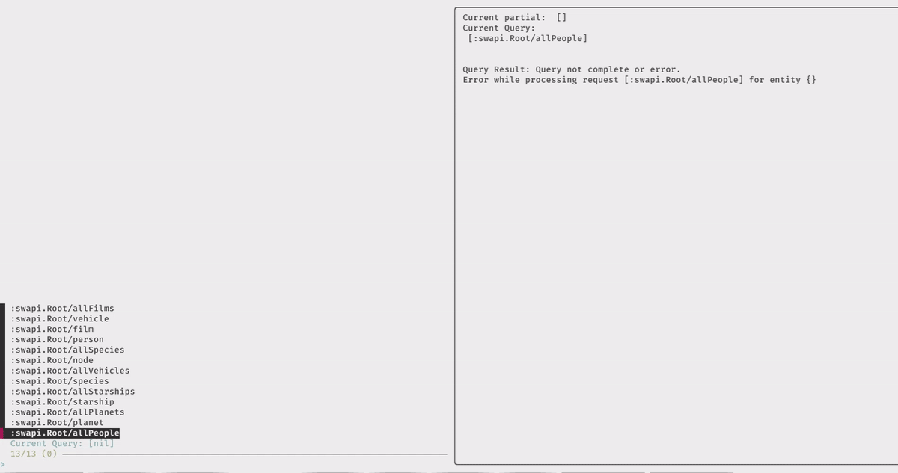

Title: PhuzQL: A Fuzzy GraphQL Explorer with Babashka, Pathom, and FZF (PoC)
Date: 2025-02-21
Tags: clojure, babashka, fzf, pathom, api, graphql, interactive, explorer, proof-of-concept
Description: Explore a proof of concept for an interactive GraphQL explorer using Clojure and fzf.  
             This project demonstrates fuzzy navigation for building and executing queries with the Star Wars API.

I've recently been exploring new ways to make use of Pathom's indexes. The
result is a _very_ basic proof of concept implementation of an interactive
GraphQL explorer. I'm going with the working title PhuzQL. This article
explains the idea and implementation components.

You can find the code in my [PhuzQL repo][].

## PhuzQL: A GraphQL Fuzzy Finder
First, a quick demo gif...

- initially fzf opens at the root of the GraphQL index
- typing results in a fuzzy search of the available attributes
- arrow keys let you navigate the filtered list
- hovering over an item temporarily adds it to the query (like `totalCount`)
- `enter` selects an item and updates the list with the newly reachable attributes
- `tab` allows for multi-select, updating the query results in the preview window

## Components
### Pathom3
If you haven't heard of Pathom before, I covered a brief introduction in the
previous post on [Pathom3 Instrumentation][]. In short, Pathom is a Clojure
library for navigating a graph of related attributes.

The point of leverage in this PoC is Pathom's [index-io][] index, which
tells us which attributes are directly reachable from the attributes you
already have. In the demo above, we can only request specific attributes about
all films once we've included the `:swapi.FilmsConnection/films` node in our
query.

Further, the entire Pathom environment is created by consuming the SWAPI
GraphQL index. This is done with [pathom3-graphql][] which uses dynamic
resolvers to translate the GraphQL index to a Pathom graph that can easily be
queried using EQL.

See the docs on [Pathom3 GraphQL Integration][] for more details.

### Babashka & fzf
Babashka is a scripting environment for Clojure. It has a very fast startup
time which is important here to make the interactive experience smoother.
PhuzQL uses it to invoke fzf, the interactive fuzzy-finder used to filter and
display query results. In the PoC implementation, I'm using the [fzf.clj][]
library which makes it easier to use fzf from Clojure. The preview window
invokes an external Babashka script each time each time the attribute selection
changes.

## Potential Improvements
This project is very much in the experimental state. Some improvements that
could be made:

- easier usage, user-configurable GraphQL API selection
- parameters
- multiple query branches
- query navigation
- preview window colors and metadata
- data visualizations
- copying results and queries

It has been fun piecing this together so far. I'm not entirely certain I'll be
iterating on it more in the near future, but I'll take some hammock time to
think about applications that could be interesting. In general, I think putting
these components together shortens the feedback loop in working with GraphQL
APIs. It can be used for API exploration, data analysis and IDE integration.

[PhuzQL repo]: https://github.com/sheluchin/phuzql
[Pathom3 Instrumentation]: /pathom3_instrumentation.html
[Pathom3]: https://pathom3.wsscode.com/
[Pathom3 GraphQL Integration]: https://pathom3.wsscode.com/docs/integrations/graphql/
[pathom3-graphql]: https://github.com/wilkerlucio/pathom3-graphql
[fzf]: https://junegunn.github.io/fzf/
[fzf.clj]: https://github.com/joakimen/fzf.clj
[Babashka]: https://book.babashka.org/
[SWAPI GraphQL API]: https://swapi-graphql.netlify.app/
[index-io]: https://pathom3.wsscode.com/docs/indexes/#index-io
