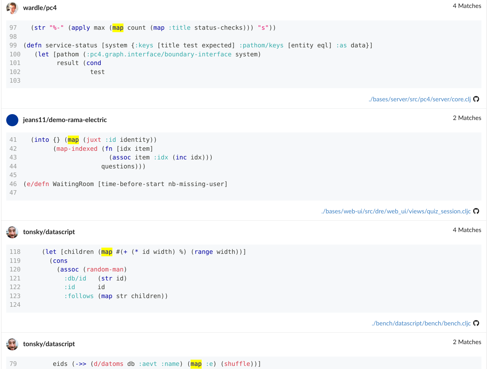

Title: Introducing seqfind.com
Date: 2025-07-23
Tags: clojure, seqfind, projects, announcements
Description: Discover how popular Clojure(Script) libraries are used in the wild. seqfind.com lets you explore real-world code examples to learn faster and find common usage patterns.

I'm officially launching [seqfind.com][] -- the Clojure(script) code
explorer.

Technically, this is a relaunch. I did a soft launch with just a handful of repos
a few years ago, but for various reasons I was unable to push it to the next stage
until now. It now contains the majority of the Clojure OSS ecosystem on GitHub,
courtesy of the fantastic [Dewey][] data set maintained by
[phronmophobic][] (Adrian Smith) which uses [clj-kondo analysis][] to extract
data from GitHub.

This post explains what seqfind is, how to use it, what's new and what's
planned since that initial early release back in 2022.

## A Brief Intro

> Would you like to optimize your learning of Clojure? Would you like to focus
> on learning only the most useful parts of the language first? Take this
> lesson from second language learning: learn the expressions in order of
> frequency of use.

> - Eric Normand in [The 100 Most Used Clojure Expressions][]

This article was the inspiration for seqfind and also a big part of my Clojure
journey. I realized that the approach of becoming familiar with the most
frequently used parts of the Clojure language could also be extended to the
many libraries in its ecosystem to optimize learning. Further, because its a lisp,
traversing code as a set of lists makes it well-suited for analysis.

The idea was clear: make it easy to look at any library to find its most useful
parts and how people are using them in real applications. In most libraries, a
small number of functions account for the vast majority of usage, while the
rest are infrequently used. seqfind is there to help you identify and study them.

This project is a living counterpart to project documentation. It's a database
of real-world usage examples of functions from across the open source Clojure
ecosystem on GitHub.

My hope is that this helps both library users as well as their authors. Perhaps
it can complement written docs and allow maintainers to identify usage patterns
they weren't aware of and never intended.

## An Example: `clojure.core/map`

Suppose you're new to Clojure and want to see more examples of using `map`.
You navigate to the corresponding seqfind page at
[seqfind.com/clojure/clojure/clojure.core/map/usages][map usages] and see something
like this:

The results are fairly illuminating. From the fn's docstring you learn that
`map` returns a lazy sequence and some other details, but the writing is
fairly terse:

> Returns a lazy sequence consisting of the result of applying f to
the set of first items of each coll, followed by applying f to the set of
second items in each coll, until any one of the colls is exhausted.  Any
remaining items in other colls are ignored. Function f should accept
number-of-colls arguments. Returns a transducer when no collection is
provided.

The seqfind results show a different angle. `map` can be used in at least a few
different ways (in order):

- with a simple fn name like `count`
- as an `into` transducer's `xform` with function composition through `juxt`
- with an shorthand anonymous fn `#(...)`
- as part of a `->>` sequence transformation macro with a keyword argument `:e`

If you're new to Clojure, these examples can teach you many things that aren't
plainly evident from the docs.

While I chose to showcase the well-known `map` fn here, what I want to
emphasize is that you can get similar examples for _most_ functions in the
entire ecosystem - whether they are from any of the official Clojure libraries
or some relatively unknown library with just a few users.

What I found very satisfying was that I used seqfind myself in the creation of
seqfind! While trying to figure out different parts of Fulcro (which seqfind is
built on), I regularly consulted the relevant function profiles in seqfind to
help me better understand what I read in Fulcro's docs.

## Some Details

Quite a bit has changed since that initial early release in 2022:

- URL structure now takes inspiration from cljdoc.org:
  - `/clojure/clojure/functions`: the repo's profile showing popular functions
    - `/clojure/clojure/clojure.core` the namespace's profile showing its functions
    - `/clojure/clojure/clojure.core/map/usages` the function's profile showing its usages
    - etc.
- search and pagination
- a LOT more repos

Admittedly, much more polish is needed for both performance and UI
improvements, but since it's already a useful resource and having it live will
help me learn more about making better, I decided to go ahead with the release.

## Coming Soon
You can expect many more features and improvements to land in the near future.
I'll continue to refine the data pipeline and improve usability.

Since my post on Slack last week about relaunching, I addressed the few bugs
that were reported in that thread:

- repo stargazer counts have been updated to be much more recent (not realtime)
- a small UI bug duplicating fn arities in the tooltip was fixed
- a bug in the DBT pipeline was fixed, adding approximately 400 repos that
  were previously missed

Please contact me on Slack @sheluchin if you have any feedback at all.

As for next, my top priorities are:

- stability, performance
- UI cleanup
- a REST API

At the moment, I'm not worried about the complete lack of mobile support, since
I don't think this tool is very likely to be used on the go - you'll most
likely be sitting at a desktop. I'm happy to re-prioritize this if I get
feedback to the contrary.

I hope you find it useful. Go explore the ecosystem at [seqfind.com][] and
please let me know what you think!

[Dewey]: https://github.com/phronmophobic/dewey
[phronmophobic]: https://blog.phronemophobic.com/
[The 100 Most Used Clojure Expressions]: https://ericnormand.me/article/100-most-used-clojure-expressions
[map usages]: https://seqfind.com/clojure/clojure/clojure.core/map/usages
[clj-kondo analysis]: https://github.com/clj-kondo/clj-kondo/tree/master/analysis
[seqfind.com]: https://seqfind.com
